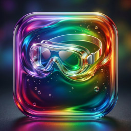

= Behrang Saeedzadeh

[quote, Nietzsche, The Twilight of Idols]
When one has one's wherefore of life, one gets along with _almost_ every how.

'''

[.text-center]
[discrete]
Music &#x2219; Philosophy &#x2219; History &#x2219; Programming

'''

[.text-center]
[discrete]
&nbsp;
&nbsp;&nbsp;&nbsp;&nbsp;&nbsp;&nbsp;
&nbsp;
&nbsp;&nbsp;&nbsp;&nbsp;&nbsp;&nbsp;
&nbsp;
&nbsp;

&nbsp;
&nbsp;
&nbsp;
&nbsp;&nbsp;&nbsp;&nbsp;&nbsp;&nbsp;
&nbsp;
&nbsp;&nbsp;&nbsp;&nbsp;&nbsp;&nbsp;
&nbsp;
&nbsp;
&nbsp;&nbsp;&nbsp;&nbsp;&nbsp;&nbsp;
&nbsp;

== About Me

Accomplished software developer with 25 years of experience and a proven track
record of designing, implementing, and maintaining solutions for banking,
energy, media, sports betting and other verticals.

== GitHub Organizations

[cols="a", frame=none, grid=none]
|===
| === https://github.com/espiria[Espiria] +

| === https://github.com/gogglesa[GoggleSA] +

|===
